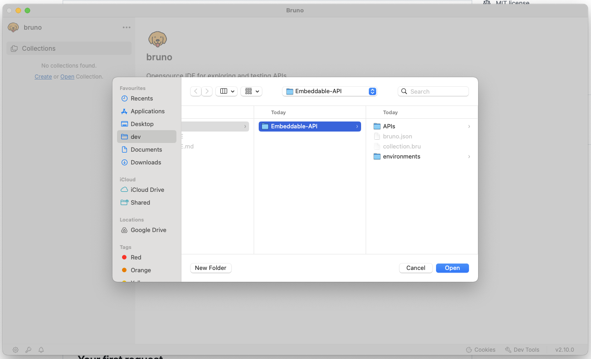
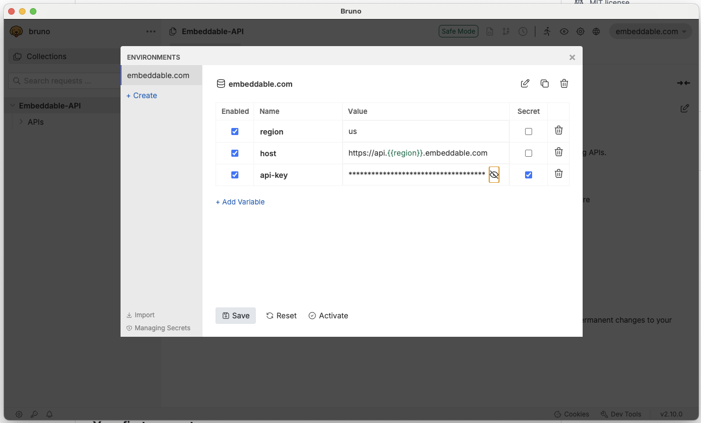
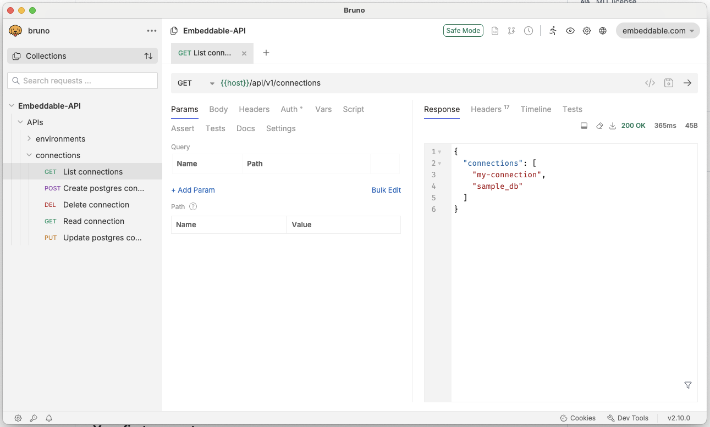

# Embeddable Public APIs

Get started with [Embeddable](https://embeddable.com)'s customer-facing APIs (listed [here](https://github.com/embeddable-hq/embeddable-public-apis/tree/main/bruno/Embeddable-API/APIs)).

<a target='_blank' href='https://fetch.usebruno.com/?url=https%3A%2F%2Fgithub.com%2Fembeddable-hq%2Fembeddable-public-apis'>
  </img>
</a>

## Getting started

 - Clone (or download) this repo locally
 	- e.g. `git clone https://github.com/embeddable-hq/embeddable-public-apis.git`
 - Install Bruno ([here](https://docs.usebruno.com/get-started/bruno-basics/download))
 	- e.g. `brew install bruno`
 - Open Bruno (e.g. on Mac Bruno appears in the Applications folder)
 - Click 'Open collection' and choose the `bruno/Embeddable-API` collection in your downloaded repo.

 

 - Select "Embeddable-API" from the left-hand menu.
 - Choose "Safe mode" when prompted.

## Configuring Bruno

 - In the top-right corner of Bruno, choose 'No environment'->'embeddable.com'.
 - Now, in the same menu, click 'Configure'.
 - Enter your workspace `region` ([eu or us](https://docs.embeddable.com/deployment/deployment-regions)) and enter your Embeddable `api-key` (from [here](https://docs.embeddable.com/getting-started/set-up-your-workspace)).
 - Click Save.

 

## Your first request
 - Navigate to Connections -> List connections.
 - Click the right arrow (->) on the right side of the screen to execute the request.
 - You should see the response appear in the right panel.

 

 - For other requests you may need to update the `Body` or `Vars` for them to run correctly.

 ## Troubleshooting

  - Error: `getaddrinfo ENOTFOUND {{host}}`
  	- Solution: make sure you've picked `embeddable.com` as your environment (top right corner)
